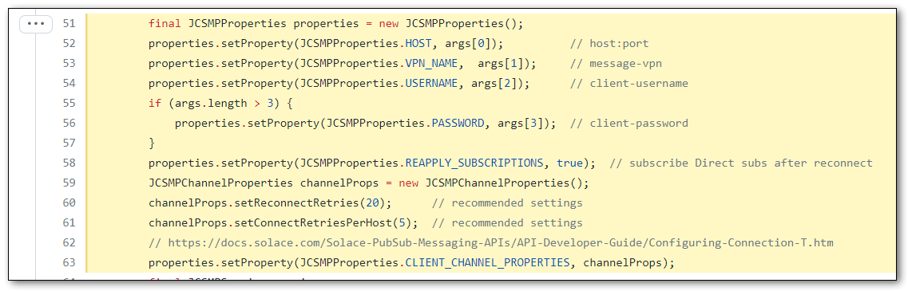
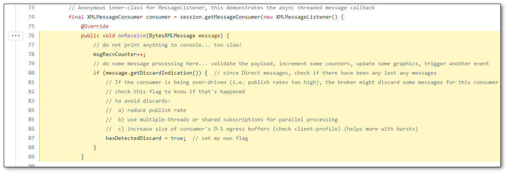
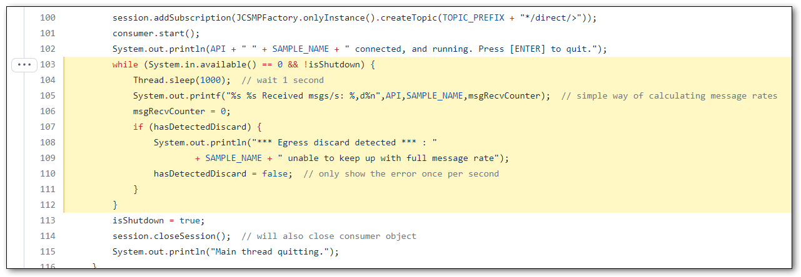
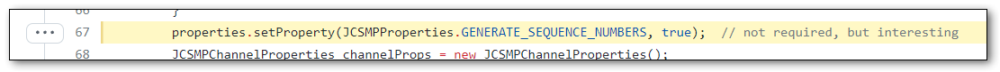
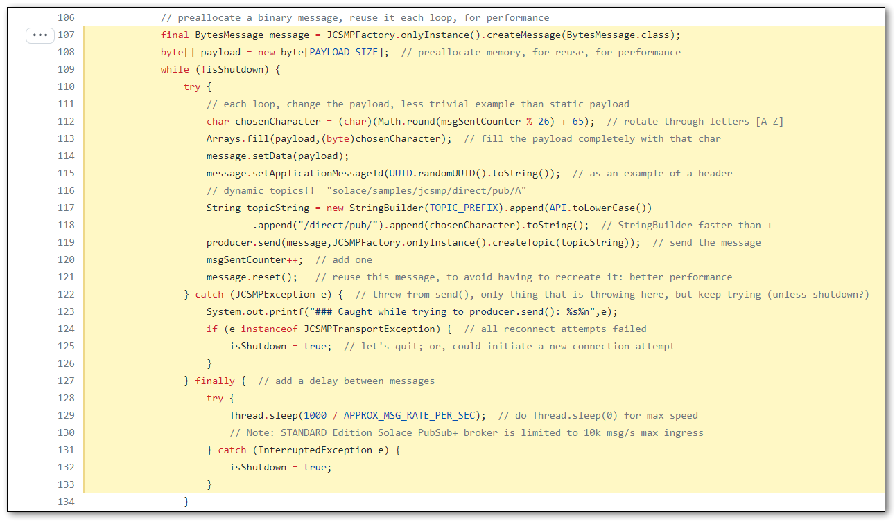

# Direct Publish/Subscribe

This tutorial assumes you’ve already reviewed the basic concepts found in the [Hello World](../HelloWorld) tutorial. This tutorial expands on those, and increases the performance.

Note that these samples are using **Direct Messaging**, Solace’s “at-most-once” or “best-effort” quality of service.  This is in contrast with **Guaranteed** Messaging, or _persistent_ messaging, which offers a high quality-of-service in terms of reliability and guarantees against message loss if used correctly.

Use of Direct Messaging is great for:
- Introductory applications like this one
- *High performance* applications where every millisecond (or even microsecond) count!
- Compatibility with Internet of Things (IoT) applications that use MQTT QoS 0, at-most-once delivery
- Applications that can tolerate some message loss in failure scenarios:
    - Low-value data (e.g. temperature sensor publishing every second)
    - Real-time requirement, where cached/buffered/delayed data is useless
    - Use of sequence numbers to detect gaps
    - Local caches / datagrids available to fetch lost data

## 1. DirectSubscriber

For Direct messages to be received, a consumer/subscriber application must be online (connected to a PubSub+ event broker) and subscribed to the appropriate topics. If there is a requirement that a consumer receives all messages that were sent, even when offline, then consider looking at the Guaranteed Pub/Sub samples.

So we'll start by looking at the `DirectSubscribe` sample application.

### 1. a) Connection Options - reconnection timers

As with the `HelloWorld` sample, the `DirectSubscriber` reads connection parameters from command line.  Some additional connection parameters include changing the default values of reconnection attributes "retries per host" and "reconnect retries".  For more information on reconnection parameters, check [this section of the Developers Guide](https://docs.solace.com/Solace-PubSub-Messaging-APIs/API-Developer-Guide/Configuring-Connection-T.htm).

### 1. b) `onReceive()` callback

This time, in the callback handler that the API runs when it receives a message, rather than printing it out to the console (which is quite slow), we will simply increment an integer counter to keep track of how many messages have been received.

There are many methods, checks, and properties you can query on the received message.  As an example, you may want to check if the message has a discard flag indication set.  This is available on most Solace native APIs, and returns true if at least one Direct message was discarded by the broker before receiving this message.  This can happen if the publisher is publishing too fast, or this subscriber is too slow.

**The important point here is:** the thread running this callback in an API-owned thread. You should endeavour to not take "too long" processing the message inside this callback, allowing control of the thread to pass back to the API.  Different APIs have slightly different threading models, which should be considered as well:

- C/C#: there is only 1 context thread, which is responsible for reading data off the socket as well as dispatching callbacks to the application; it is imperative to not block the callback method
- JavaScript: there is only 1 thread in the browser, so definitely don't take too long; consider the use of Web Workers
- Java JCSMP: by default, there are two context threads: one reactor thread reading data off the socket, one dispatcher thread to run message callbacks, with a in-memory buffer between them; hence, it is not as critical for the application to not block in the callback method
- Java: each `MessageReceiver` object in the API has its own thread and internal buffer for sending messages to the application, so it is not as important to return very quickly.
- Python (?)

For more information on threading models, check [this section of the Developers Guide](https://docs.solace.com/Solace-PubSub-Messaging-APIs/API-Developer-Guide/API-Threading.htm).

### 1. c) Show me the rates!

All that remains to do is add the topic subscription `solace/samples/*/direct/>` and start the consumer which allows it to start receiving messages.

The program then just loops waiting for the user to press "ENTER" to exit.  Every second, it displays the received message rate on the screen. This can be useful when troubleshooting, or comparing to either the publisher's rates or the rate statistics that the broker is tracking.

## 2. DirectPublisher

Now that the subscriber is connected and running, it is time to start the Direct messaging publisher app.

### 2. a) Connection Options - sequence number

Similar to the Direct messaging subscriber, we'll configure the connection parameters including changing the default reconnection values.  Also, just for something interesting / as a demonstration, we'll ask the API to automatically assign increasing sequence numbers on each message. In more production-quality applications, often the publisher will "manually" set sequence numbers or unique IDs on every published message, sometimes on a per-topic basis; this helps the subscribing application to detect any gaps in the message stream due to discards.

### 2. b) Publishing Loop

Now we're ready to start publishing messages. This application will continually publish messages to a specified topic, sleep / delay for some amount of time, and repeat – until the user presses ENTER to exit.

As each Solace native API is slightly different, and each implementation language has its own behaviours and best practices, the exact code inside the publish loop can vary.  Ideally:

- reuse Message objects if possible (JCSMP, CCSMP) by calling `reset()` to prevent unnecessary heap churn
- topics can (and should!) be dynamic in Solace, so these samples show an example way of doing that

These Direct messaging publisher and subscribe samples are meant to be fairly performant. For example, on a tuned lab setup with 1 GbE, the JCSMP samples can sustain 240,000 msg/s with 200 byte payloads.

